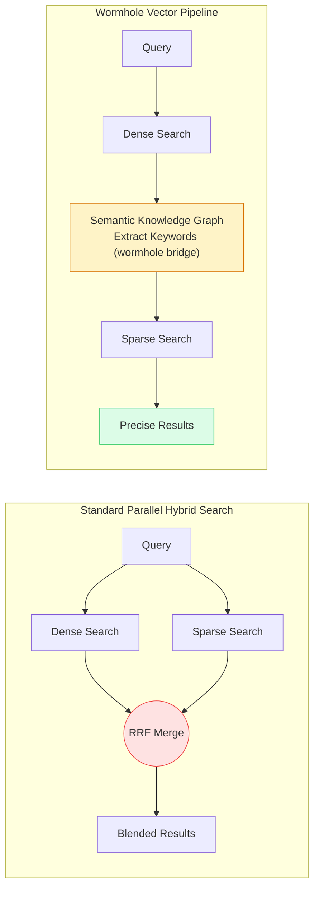
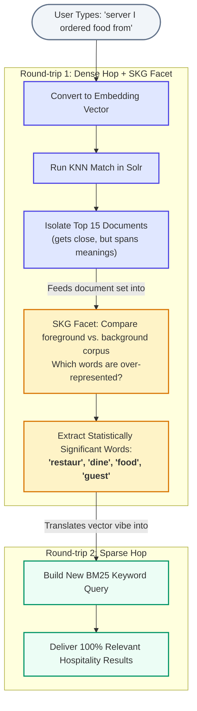
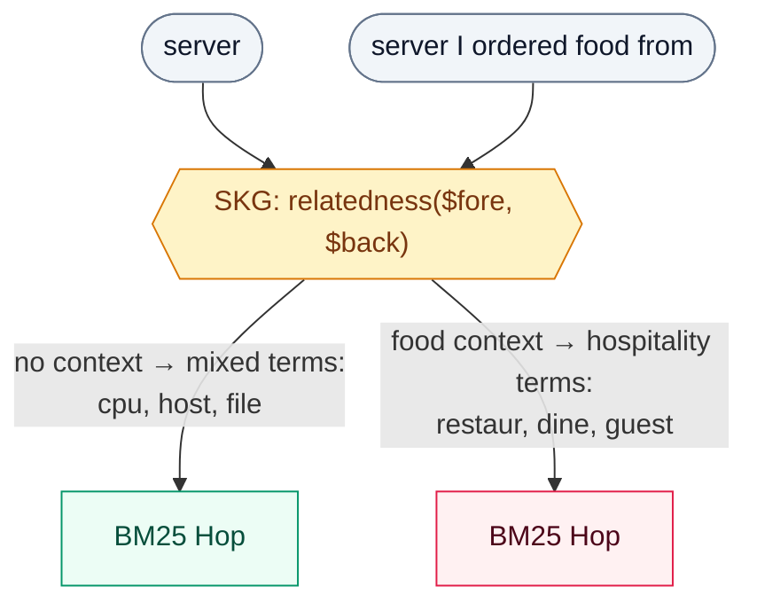

# 🌌 Wormhole Vectors PoC

This project is a Proof of Concept (PoC) implementing **Wormhole Vectors** — a search retrieval technique proposed by Trey Grainger. The idea: use a vector search to find the right documents, then use those documents as a shortcut from meaning-space into keyword-space — so the two work together instead of running on separate tracks. Built on Apache Solr.

### ❓ The Problem It Solves

Modern search engines usually use two separate tracks to find information:

1. **Dense Vector Search (AI/Embeddings):** Looks for conceptual meaning. It is great at capturing abstract intent, but it acts like a "black box" — you don't easily see *why* the AI thought two things were related.
2. **Sparse Keyword Search (Traditional/BM25):** Looks for exact word matches. It is fully explainable, but it is easily tricked by synonyms or ambiguous words.

Traditional "hybrid search" setups simply run both tracks completely in parallel and smash the results together using a blending algorithm like Reciprocal Rank Fusion (RRF).

### 🚀 The Wormhole Solution

Instead of running two isolated tracks, a **Wormhole Vector** traverses through two search spaces sequentially — using the document set to hop from one to the other. Here's how it works:

**Start in Dense Space:** User searches for `server I ordered food from`. The query is converted to a vector embedding, and Solr finds the 15 nearest documents.
*Result: All results are about hospitality — the vector understood that "ordered food from" pulls `server` toward restaurant context, not tech.*

**Bridge via SKG:** Solr runs a Semantic Knowledge Graph `relatedness()` analysis on those documents — asking "what words show up here way more than in the background corpus?"
*Result: Statistically significant terms emerge — `{restaur, dine, food, guest}`. These are human-readable keywords that represent the "vibe" the dense space found — no synonym list required.*

**Hop to Sparse Space:** Those keywords become a BM25 search (boosted by their relatedness scores).
*Result: Results land precisely in the hospitality domain — zero stray tech titles, and the SKG term list explains exactly why the pivot happened.*

*(See [Concept Overview](#-concept-overview) for how each step is configured under the hood.)*

#### Pipeline Architecture Comparison



> **SKG** = Semantic Knowledge Graph — Solr's built-in `relatedness()` function that compares term frequencies between a target document set and the full corpus. Explained in detail in [Concept Overview](#-concept-overview) below.

#### Approach Capability Matrix

| Search Type | Captures Abstract Intent? | Fully Explainable? | Handles Ambiguity? |
| --- | --- | --- | --- |
| **1. Dense Only (AI)** | ✅ | ❌ *Black Box* | ❌ *Can drift without context* |
| **2. Sparse Only (BM25)** | ❌ *Literal words only* | ✅ | ❌ *Confused by synonyms* |
| **3. Hybrid (RRF Smash)** | 🧠 *Sort of* | ❌ *Scores are blended math* | ⚠️ *Stray results from both tracks* |
| **🌌 Wormhole Search** | ✅ | ✅ | ✅ |

> Hybrid search (RRF) can handle ambiguity reasonably well with strong individual retrievers. Wormhole's advantage is *explainability* — the SKG terms tell you *why* the pivot happened, and the sparse hop inherits that precision. The matrix above highlights structural differences, not absolute quality rankings.

---

## Table of Contents

- [🧠 Concept Overview](#-concept-overview)
- [🚀 Key Features](#-key-features)
- [🎯 Examples](#-examples)
- [🛠️ Setup & Ingestion](#-setup--ingestion)
- [⚙️ Configuration](#-configuration)
- [📁 File Structure](#-file-structure)
- [📺 Reference](#-reference)

---

## 🧠 Concept Overview

Wormhole vectors bridge two traditionally isolated search spaces:

1. **Dense Vector Space**: Semantic embeddings that capture abstract meaning but lack explainability.
2. **Sparse Keyword Space**: Traditional BM25 keyword search that is explainable but blind to vocabulary context.

The "wormhole" is created across two Solr round-trips:



- **The Dense Hop (AI Concept Search):** We run a quick nearest-neighbor vector query (KNN) to isolate a small, contextual group of documents (the "Foreground Set"). This gets us *close* — but "close" in vector space can span multiple meanings. For a query like `server`, the foreground set might include both tech infrastructure docs and restaurant docs. The dense hop is necessary but insufficient on its own.

- **The SKG Facet (Keyword Extraction):** We use Solr's Semantic Knowledge Graph (SKG) `relatedness()` function to compare the foreground set against the background corpus (the full index) and ask: *"What specific words appear here way more often than they do in the background corpus?"* Think of it like walking into a room where everyone's talking about restaurants — you'd quickly pick up that words like `menu`, `tip`, and `dining` are common here but rare in the rest of the building. SKG does this statistically, extracting keywords that are highly significant to our specific context in real time. The KNN query and the SKG facet run in the *same* Solr request.

- **The Sparse Hop (Traditional Search):** We take those freshly derived terms and build a traditional keyword query (BM25), boosted by each term's relatedness score, to land precisely in the correct keyword domain. This is where the wormhole's value crystallizes: the dense hop got us close, the SKG facet told us *what vocabulary* defines that neighborhood, and the sparse hop uses that vocabulary to find exactly the right documents — explainably and precisely. The final results prioritize these sparse hits, backfilling from the dense set if needed.

> **Note on stemmed terms:** The SKG terms shown above (`restaur`, `dine`, `attent`) are truncated by Solr's Porter stemmer during indexing and analysis — `restaurant` becomes `restaur`, `dining` becomes `dine`, `attentiveness` becomes `attent`. This is intentional: stemming collapses plural/singular and inflected forms into one token so that `server` and `servers` are treated as the same term for both matching and statistical significance.

> **Note on ranking:** Within each hop, results are ordered by that hop's own relevance score (BM25 score for sparse, vector similarity for dense). But sparse and dense aren't on a shared scale — the merge step lists all sparse results first, then backfills remaining slots with dense results, without re-scoring one against the other. So a wormhole result's *position* in the final list reflects which hop found it and that hop's internal ranking, not a unified relevance score across both.

---

## 🚀 Key Features

- **Automatic Disambiguation**: Distinguishes between ambiguous words (e.g., `server` = tech infrastructure vs. restaurant staff) without relying on manually maintained synonym lists.
- **Built-in Explainability**: Opens the vector "black box" by generating human-readable keywords that explain exactly *why* a result matched.
- **Solves Vocabulary Gaps** *(conceptual — not demonstrated by this repo's demo corpus)*: The technique generally bridges zero-result lexical mismatches. Hypothetically, if an item were indexed as `Donut` and a user searched `sweet dough ring`, a wormhole hop through dense space would find it and map back to real keywords — without a hand-maintained synonym list. This repo's demo corpus focuses on term disambiguation instead (see [Examples](#-examples) below for what actually runs).

---

## 🎯 Examples

The sample corpus contains explicit contextual overlaps across four ambiguous terms: `Java`, `Mercury`, `Python`, and `server`. The examples below use both single-word and multi-word queries to demonstrate disambiguation, ranking quality, and explainability.

Every example below runs the same raw query two ways: through the wormhole pipeline, and as a plain BM25 keyword search on the query string with nothing else applied — what you'd get without any of this.

> Each `term(score)` pair is the SKG term and its `relatedness()` value (0.000–1.000) — how statistically over-represented that term is in the foreground set vs. the background corpus. See [Concept Overview](#-concept-overview) above for how these are derived, including the note on how they relate to result ranking.

### Case 1: Ambiguity With Zero Context (`server`)

```
Query: server
SKG terms: [server(0.066), allergen(0.040), attent(0.040), commun(0.040), coordin(0.040), cpu(0.040), file(0.040), host(0.040)]

Wormhole Results                       │ Plain BM25 Search
--------------------------------------─┼─--------------------------------------
Food Allergen Awareness for Servers    │ Web Server Load Balancing
Apache HTTP Server Configuration       │ Food Allergen Awareness for Servers
Restaurant Server Training Guide       │ Server Monitoring with Prometheus
Bar and Restaurant Server Teamwork     │ Bare Metal vs Cloud Servers
Server CPU and Memory Sizing           │ Firewall and iptables on Linux Servers
```

**Behavior**: With no explicit context provided, there is no clean split. The SKG terms go both ways (stemmed forms like `attent`/`commun` from hospitality alongside `cpu`/`host` from tech) and the Wormhole column mixes tech and hospitality. The plain BM25 search leans mostly tech here (4 of 5), but that's just a coincidence from the raw term frequency, not structural disambiguation — there's no mechanism steering it either way.

### Case 2: Intent-Driven Context Steering

Here's what happens once there's context:

```
Query: server I ordered food from
SKG terms: [restaur(0.067), server(0.066), servic(0.061), dine(0.048), food(0.048), protocol(0.048), requir(0.043), guest(0.041)]

Wormhole Results                       │ Plain BM25 Search
--------------------------------------─┼─--------------------------------------
Restaurant Server Training Guide       │ Point of Sale Systems for Servers
Fine Dining Table Service Etiquette    │ Food Safety Training for Servers
Server Burnout in the Restaurant Ind.  │ Server Tip Pooling Policies
Server Tip Pooling Policies            │ Web Server Load Balancing
Food Safety Training for Servers       │ Fine Dining Table Service Etiquette
```

The extra words pull the dense hop fully into hospitality, so the dominant SKG terms and every result land there too. (A couple of noisier terms like `protocol` and `requir` still surface — the foreground set is small — but the relatedness-boosted BM25 hop keeps the right documents on top.) The wormhole column has **zero stray tech titles** and the SKG terms provide a clear, human-readable explanation (`restaur`, `dine`, `guest`) for *why* the pivot toward hospitality happened — something a raw BM25 score cannot offer.

Plain BM25 now also picks up "food" as a literal keyword match and lands mostly on hospitality as well — but it still lets one stray tech result slip through (`Web Server Load Balancing`), and it cannot tell you *why* it returned what it did. The difference is **precision** (no strays) and **explainability** (human-readable SKG terms vs. opaque scores).



### Case 3: Cross-Domain Purity (`java`)

```
Query: java
SKG terms: [jvm(0.081), java(0.072), collect(0.055), heap(0.055), object(0.055), bytecod(0.048), garbag(0.048), class(0.040)]

Wormhole Results                       │ Plain BM25 Search
--------------------------------------─┼─--------------------------------------
Java Performance Profiling             │ Scala for Java Developers
JVM Architecture Deep Dive             │ Java Coffee Origins
Java Garbage Collection Tuning         │ Java Mocha Coffee Blend
Kotlin on the JVM                      │ Maven Build System
Java Programming Fundamentals          │ Microservices with Java
```

This is the cleanest demonstration of why the extra hop matters. `java` is lexically identical whether the corpus means the programming language or the coffee — BM25 has no way to tell, so 2 of its top 5 (40%) are off-topic (`Java Coffee Origins`, `Java Mocha Coffee Blend`). The dense hop understands *which* `java` the surrounding corpus is about before any keyword matching happens, so the SKG terms it derives (`jvm`, `bytecod`, `garbag`, `heap`, `class`) are unambiguously programming-language vocabulary — and every wormhole result stays in-domain (0 of 5 off-topic).

### Case 4: Ranking & Explainability, Not Just Precision (`restaurant`)

Unlike the other cases, `restaurant` isn't an ambiguous term — this one shows that wormhole still adds value even when disambiguation isn't the issue.

```
Query: restaurant
SKG terms: [restaur(0.067), servic(0.061), server(0.060), guest(0.055), dine(0.048), attent(0.040), clear(0.040), contact(0.040)]

Wormhole Results                       │ Plain BM25 Search
--------------------------------------─┼─--------------------------------------
Restaurant Server Training Guide       │ Server Tip Pooling Policies
Fine Dining Table Service Etiquette    │ Restaurant Server Training Guide
Server Burnout in the Restaurant Ind.  │ Bar and Restaurant Server Teamwork
Bar and Restaurant Server Teamwork     │ Server Burnout in the Restaurant Ind.
Upselling Techniques for Restaurant    │ Shift Work and Server Scheduling
```

Not every case is a domain-purity blowout like Case 3 — here, both columns land in hospitality, so there's no stray result to point at. The win is more subtle but still real:

- **Ranking**: BM25's top hit, `Server Tip Pooling Policies`, is about compensation policy — tangential to the query. Wormhole's top two, `Restaurant Server Training Guide` and `Fine Dining Table Service Etiquette`, are core service-skill content, arguably a better match for someone searching `restaurant`.
- **Explainability**: the SKG term list (`restaur`, `servic`, `dine`, `attent`, `contact`) is a human-readable receipt for *why* these documents matched. BM25 gives you a ranked list and a score with no rationale attached.

The lesson: even when the baseline isn't obviously wrong, wormhole still tells you *why* it's right — which is the difference that matters when you need to trust or debug a result set, not just glance at it.

### Case 5: Steering the Same Ambiguous Term the Other Way (`want to drink java`)

```
Query: want to drink java
SKG terms: [java(0.072), coffe(0.071), island(0.063), indonesian(0.053), bean(0.050), brew(0.048), origin(0.048), earthi(0.041)]

Wormhole Results                       │ Plain BM25 Search
--------------------------------------─┼─--------------------------------------
Java Coffee Origins                    │ Java Mocha Coffee Blend
Cold Brew with Java Beans              │ Hibernate ORM Guide
Brewing Methods for Indonesian Coffee  │ Kotlin on the JVM
Specialty Coffee Roasters and Java     │ Scala for Java Developers
Java Estate Coffee Review              │ Java Coffee Origins
```

This is Case 3 mirrored: same ambiguous term (`java`), opposite intent, and this time BM25 is the one that gets it badly wrong. It matches the literal token and returns `Hibernate ORM Guide`, `Kotlin on the JVM`, and `Scala for Java Developers` — 3 of 5 (60%) purely programming results for a query about drinking coffee. Wormhole's dense hop picks up on `drink`, steers entirely into coffee, and the derived SKG terms (`coffe`, `island`, `indonesian`, `bean`, `brew`, `earthi`) read like a coffee origin guide — 5 of 5 on-topic.

Together, Case 3 and Case 5 make the strongest version of the pitch: the *same* lexical token (`java`) resolves to two completely different, 100%-correct result sets depending on intent — something no keyword-only system can do, because `java` the string never changes.

---

## 🛠️ Setup & Ingestion

### Prerequisites

- Docker Desktop
- Node.js 18+

```bash
# 1. Install project dependencies
npm install

# 2. Start local Solr instance
docker compose up -d

# 3. Create schema, embed, and index the 135-document corpus
npm run ingest
```

> `npm run ingest` is fully idempotent. Re-running it rebuilds the `wormhole_demo` core from scratch.

### Execution

```bash
npm run cli
```

Type an intentionally ambiguous query to see wormhole vs. plain BM25 results side-by-side. Type `exit` or leave the line empty to quit.

### Tests

```bash
# Unit tests — no Solr required (mocked fetch)
npm test

# Integration tests — requires live Solr + ingested corpus
docker compose up -d && npm run ingest
npm run test:integration

# Everything
npm run test:all
```

**Unit tests** (`npm test`) cover query-building logic (`search.ts`) and merge logic (`wormhole.ts`) using mocked Solr responses. They verify that the right fields, boosts, and escaping are applied — no live instance needed.

**Integration tests** (`npm run test:integration`) verify retrieval *outcomes* against a live Solr instance: disambiguation correctness (all results land in the right `source` category), SKG term semantic coherence, wormhole-vs-baseline deltas, and stemming invariants. They auto-skip with a clear message if Solr is unavailable.

---

## ⚙️ Configuration

Operational settings, handled via local `.env` values:

| Variable | Default | Meaning |
| --- | --- | --- |
| `SOLR_URL` | `http://localhost:8983/solr` | Solr base URL endpoint |
| `FOREGROUND_K` | `15` | Size of dense KNN result set used to derive SKG terms |
| `SKG_LIMIT` | `8` | Maximum number of SKG terms extracted from the foreground set |
| `FINAL_K` | `5` | Total number of results displayed per search operation |

---

## 📁 File Structure

```
wormhole-poc/
├── .env                   # Environment configurations
├── docker-compose.yml      # Standalone Solr 9 container deployment profiles
├── src/
│   ├── solr-client.ts      # REST API wrapper communication modules
│   ├── embed.ts            # Xenova local text-to-vector transformer pipeline
│   ├── solr.ts             # Core collections schema deployment scripts
│   ├── search.ts           # Solr dense vector, BM25, and SKG facets functions
│   ├── wormhole.ts         # Orchestrates the dense→SKG→sparse pipeline
│   └── cli.ts              # Interactive side-by-side validation test REPL
├── scripts/
│   └── ingest.ts           # Seeding script containing target test datasets
└── tests/
    ├── search.test.ts            # Query-building unit tests (mocked fetch)
    ├── wormhole.test.ts          # Merge-logic unit tests (pure functions)
    └── integration/
        └── integration.test.ts   # End-to-end live Solr retrieval tests
```

---

## 📺 Reference

[Beyond Hybrid Search: Traversing Vector Spaces with Wormhole Vectors](https://www.youtube.com/watch?v=fvDC7nK-_C0) — the talk this repo implements.
