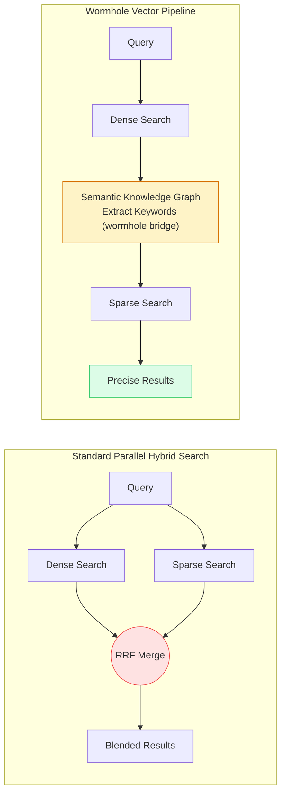
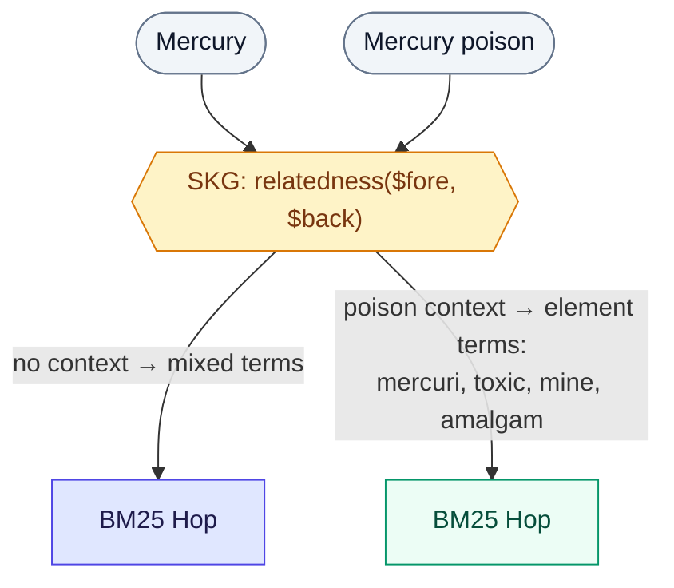

# 🌌 Wormhole Vectors PoC

**Search "java" and get programming results when that's what you mean, or coffee results when it's not — automatically, without synonym lists.**

This project is a PoC implementing **Wormhole Vectors** — a search retrieval technique proposed by Trey Grainger. 

The idea: use a vector search to find the right neighborhood of documents, then let those documents tell you which keywords to search with — so the second search is guided by the first, not running blind on the raw query. Built on Apache Solr.

## Table of Contents

- [The Problem It Solves](#the-problem-it-solves)
- [The Wormhole Solution](#the-wormhole-solution)
- [Examples](#examples)
- [Other Traversal Directions](#other-traversal-directions)
- [Concept Overview](#concept-overview)
- [Setup & Ingestion](#setup--ingestion)
- [Configuration](#configuration)
- [File Structure](#file-structure)
- [Reference](#reference)

---

## The Problem It Solves

Modern search engines usually use two separate tracks to find information:

1. **Dense Vector Search (AI/Embeddings):** Looks for conceptual meaning. It's great at capturing abstract intent, but it acts like a "black box" — you don't easily see *why* the AI thought two things were related.
2. **Sparse Keyword Search (Traditional/BM25):** Looks for exact word matches. It's fully explainable, but it's easily tricked by synonyms or ambiguous words.

Today's common fix, "hybrid search," just runs both tracks in parallel and blends the results together (typically via Reciprocal Rank Fusion, or RRF) — without actually fixing either technique's weakness above. 

That's the gap Wormhole Vectors close. Instead of blending, they connect: the documents from the first search become the keywords for the second. So ambiguity actually gets resolved, and you get a plain-English reason why — not just a blended score.

---

## The Wormhole Solution

A **Wormhole Vector** closes that gap by traversing through two search spaces sequentially — using the document set to hop from one to the other. Here's how it works:

1. **Start in Dense Space:** User searches for `server I ordered food from`. The query is converted to a vector embedding, and Solr finds the 15 nearest documents.
   - *Result: All results are about hospitality — the vector understood that "ordered food from" pulls `server` toward restaurant context, not tech.*

2. **Bridge via SKG:** Those 15 documents are passed into Solr's Semantic Knowledge Graph `relatedness()` function, which compares the words in them against the whole corpus — asking "what words show up here way more than in the background corpus?"
   - *Result: Statistically significant terms emerge — `{restaur, dine, food, guest}`. These are human-readable keywords that represent the "vibe" the dense space found — no synonym list required.*
   
3. **Hop to Sparse Space:** Those keywords become a BM25 search (boosted by their relatedness scores).
   - *Result: Results land precisely in the hospitality domain — zero stray tech titles, and the SKG term list explains exactly why the pivot happened.*

*(See [Concept Overview](#concept-overview) for how each step is configured under the hood.)*

### Pipeline Architecture Comparison



### Approach Capability Matrix

| Search Type | Captures Abstract Intent? | Fully Explainable? | Handles Ambiguity? |
| --- | --- | --- | --- |
| **1. Dense Only (AI)** | ✅ | ❌ *Black Box* | ❌ *Can drift without context* |
| **2. Sparse Only (BM25)** | ❌ *Literal words only* | ✅ | ❌ *Confused by synonyms* |
| **3. Hybrid (RRF Smash)** | 🧠 *Sort of* | ❌ *Scores are blended math* | ⚠️ *Stray results from both tracks* |
| **🌌 Wormhole Search** | ✅ | ✅ | ✅ |

> Hybrid search (RRF) can handle ambiguity reasonably well with strong individual retrievers. Wormhole's advantage is *explainability* — the SKG terms tell you *why* the pivot happened, and the sparse hop inherits that precision. The matrix above highlights structural differences, not absolute quality rankings.

---

## Examples

The sample corpus contains explicit contextual overlaps across four ambiguous terms: `Java`, `Mercury`, `Python`, and `server`. The examples below use both single-word and multi-word queries to demonstrate disambiguation, ranking quality, and explainability.

Every example below runs the same raw query two ways: through the wormhole pipeline, and as a plain BM25 keyword search on the query string with nothing else applied — what you'd get without any of this.

> Each `term(score)` pair is the SKG term and its `relatedness()` value (0.000–1.000) — how statistically over-represented that term is in the foreground set vs. the background corpus. See [Concept Overview](#concept-overview) below for how these are derived, including the note on how they relate to result ranking.

### Case 1: Ambiguity With Zero Context (`server`)

```
Query: server
SKG terms: [server(0.066), allergen(0.040), attent(0.040), commun(0.040), coordin(0.040), cpu(0.040), file(0.040), host(0.040)]

Wormhole Results                       │ Plain BM25 Search
--------------------------------------─┼─--------------------------------------
Food Allergen Awareness for Servers    │ Web Server Load Balancing
Apache HTTP Server Configuration       │ Food Allergen Awareness for Servers
Restaurant Server Training Guide       │ Server Monitoring with Prometheus
Bar and Restaurant Server Teamwork     │ Bare Metal vs Cloud Servers
Server CPU and Memory Sizing           │ Firewall and iptables on Linux Servers
```

**Behavior**: With no explicit context provided, there is no clean split. The SKG terms go both ways (stemmed forms like `attent`/`commun` from hospitality alongside `cpu`/`host` from tech) and the Wormhole column mixes tech and hospitality. The plain BM25 search leans mostly tech here (4 of 5), but that's just a coincidence from the raw term frequency, not structural disambiguation — there's no mechanism steering it either way.

### Case 2: Context Steering a Three-Way Ambiguous Term (`Mercury poison`)

Case 1 showed what happens with no context. Here's what happens once there is — using a term with *three* senses (planet, element, car brand):

```
Query: Mercury poison
SKG terms: [mercuri(0.067), mine(0.048), toxic(0.048), atom(0.041), amalgam(0.040), element(0.040), histor(0.040), releas(0.040)]

Wormhole Results                       │ Plain BM25 Search
--------------------------------------─┼─--------------------------------------
Mercury in Gold Mining                 │ Mercury Toxicity and Health Risks
Mining and Extraction of Mercury       │ Mining and Extraction of Mercury
Mercury Toxicity and Health Risks      │ Mercury Marquis Dealerships
Mercury the Chemical Element           │ Mercury in Gold Mining
Mercury Amalgam in Dentistry           │ The Minamata Convention on Mercury
```

`Mercury` is ambiguous across planet, chemical element, and car brand. BM25 matches the literal token and returns mostly element docs — but `Mercury Marquis Dealerships` (a car) slips in at position 3 because "Mercury" the string is the same regardless of meaning. The wormhole pipeline reads `poison` as context, steers the dense hop into the chemical-element domain, and the SKG terms it derives (`mercuri`, `mine`, `toxic`, `amalgam`, `element`) are unambiguously chemistry vocabulary — 5 of 5 results are `mercury_element`, 0 stray.

The difference is **domain purity** (no car or planet docs) and **explainability** — the SKG terms tell you *why* the results are about the element, not the planet or the car.



### Case 3: Cross-Domain Purity (`java`)

```
Query: java
SKG terms: [jvm(0.081), java(0.072), collect(0.055), heap(0.055), object(0.055), bytecod(0.048), garbag(0.048), class(0.040)]

Wormhole Results                       │ Plain BM25 Search
--------------------------------------─┼─--------------------------------------
Java Performance Profiling             │ Scala for Java Developers
JVM Architecture Deep Dive             │ Java Coffee Origins
Java Garbage Collection Tuning         │ Java Mocha Coffee Blend
Kotlin on the JVM                      │ Maven Build System
Java Programming Fundamentals          │ Microservices with Java
```

This is the cleanest demonstration of why the extra hop matters. `java` is lexically identical whether the corpus means the programming language or the coffee — BM25 has no way to tell, so 2 of its top 5 (40%) are off-topic (`Java Coffee Origins`, `Java Mocha Coffee Blend`). The dense hop understands *which* `java` the surrounding corpus is about before any keyword matching happens, so the SKG terms it derives (`jvm`, `bytecod`, `garbag`, `heap`, `class`) are unambiguously programming-language vocabulary — and every wormhole result stays in-domain (0 of 5 off-topic).

### Case 4: Ranking & Explainability, Not Just Precision (`restaurant`)

Unlike the other cases, `restaurant` isn't an ambiguous term — this one shows that wormhole still adds value even when disambiguation isn't the issue.

```
Query: restaurant
SKG terms: [restaur(0.067), servic(0.061), server(0.060), guest(0.055), dine(0.048), attent(0.040), clear(0.040), contact(0.040)]

Wormhole Results                               │ Plain BM25 Search
-----------------------------------------------─┼─-----------------------------------------
Restaurant Server Training Guide               │ Server Tip Pooling Policies
Fine Dining Table Service Etiquette            │ Restaurant Server Training Guide
Server Burnout in the Restaurant Industry      │ Bar and Restaurant Server Teamwork
Bar and Restaurant Server Teamwork             │ Server Burnout in the Restaurant Industry
Upselling Techniques for Restaurant Servers    │ Shift Work and Server Scheduling
```

Not every case is a domain-purity blowout like Case 3 — here, both columns land in hospitality, so there's no stray result to point at. The win is more subtle but still real:

- **Ranking**: BM25's top hit, `Server Tip Pooling Policies`, is about compensation policy — tangential to the query. Wormhole's top two, `Restaurant Server Training Guide` and `Fine Dining Table Service Etiquette`, are core service-skill content, arguably a better match for someone searching `restaurant`.
- **Explainability**: the SKG term list (`restaur`, `servic`, `dine`, `attent`, `contact`) is a human-readable receipt for *why* these documents matched. BM25 gives you a ranked list and a score with no rationale attached.

The lesson: even when the baseline isn't obviously wrong, wormhole still tells you *why* it's right — which is the difference that matters when you need to trust or debug a result set, not just glance at it.

### Case 5: Steering the Same Ambiguous Term the Other Way (`want to drink java`)

```
Query: want to drink java
SKG terms: [java(0.072), coffe(0.071), island(0.063), indonesian(0.053), bean(0.050), brew(0.048), origin(0.048), earthi(0.041)]

Wormhole Results                       │ Plain BM25 Search
--------------------------------------─┼─--------------------------------------
Java Coffee Origins                    │ Java Mocha Coffee Blend
Cold Brew with Java Beans              │ Hibernate ORM Guide
Brewing Methods for Indonesian Coffee  │ Kotlin on the JVM
Specialty Coffee Roasters and Java     │ Scala for Java Developers
Java Estate Coffee Review              │ Java Coffee Origins
```

This is Case 3 mirrored: same ambiguous term (`java`), opposite intent, and this time BM25 is the one that gets it badly wrong. It matches the literal token and returns `Hibernate ORM Guide`, `Kotlin on the JVM`, and `Scala for Java Developers` — 3 of 5 (60%) purely programming results for a query about drinking coffee. Wormhole's dense hop picks up on `drink`, steers entirely into coffee, and the derived SKG terms (`coffe`, `island`, `indonesian`, `bean`, `brew`, `earthi`) read like a coffee origin guide — 5 of 5 on-topic.

Together, Case 3 and Case 5 make the strongest version of the pitch: the *same* lexical token (`java`) resolves to two completely different, 100%-correct result sets depending on intent — something no keyword-only system can do, because `java` the string never changes.

---

## Other Traversal Directions

The dense → SKG → sparse pipeline above is one direction through the wormhole. This repo also implements the reverse hop, a broad/specific signal that adjusts how the pipeline merges results, iterative multi-hop traversal, and a third hoppable space built from (synthetic) user behavior.

### Sparse → Dense (`s2d:`)

The talk's "easy direction" (52:17): run a plain keyword search first, average the embeddings of the top-N results into a single "wormhole vector" (element-wise mean + L2 normalization), then KNN on that pooled vector.

```
s2d: coffee bean roast
Pooled 15 sparse foreground doc(s) into wormhole vector

Wormhole Results                           │ Plain BM25 Search
------------------------------------------─┼─------------------------------------------
Java Coffee Origins [D]                    │ Sumatra Coffee Roasting Guide
Coffee Bean Processing on Java Island [D]   │ Coffee Bean Processing on Java Island
Brewing Methods for Indonesian Coffee [D]   │ Specialty Coffee Roasters and Java
Sumatra Coffee Roasting Guide [D]           │ Indonesian Coffee Varietals
Specialty Coffee Roasters and Java [D]      │ Java Coffee Origins
```

Because the sparse foreground is raw BM25 with no SKG disambiguation, this direction inherits BM25's literal-matching blind spot: if the keyword search's own top results are mixed across domains, pooling them produces a muddier wormhole vector than the dense→sparse direction gets from its SKG-derived terms. It's a real hop, not a guaranteed fix.

### Query Specificity

Alongside the SKG terms, the dense→sparse pipeline now measures how tightly the foreground set clusters: the mean cosine similarity of each foreground document's embedding to the pooled centroid of the set (61:29 in the talk). A context-free query like `server` spans two unrelated domains (tech and hospitality) and scores low; a query that lands squarely in one domain scores higher.

```
Query: server
SKG category: server_hospitality(0.049), server_tech(0.040)
SKG terms: [server(0.066), allergen(0.040), attent(0.040), ...]
specificity: 0.556 (broad)
```

When the query is broad (below `SPECIFICITY_THRESHOLD`, default `0.6`), the sparse hop fetches a wider candidate set (`2 × FINAL_K`) before merging — a POC-scale version of the talk's "search a region, not a point," so a broad query isn't artificially collapsed down to a handful of results from one lucky corner of the foreground.

### Multi-Field SKG

The SKG facet used to derive keyword terms also runs a second sub-facet over the `source` field — the same `relatedness($fore,$back)` statistic, applied to a categorical field instead of a text field, mirroring the talk's `category:Korean + terms` example (69:43). It surfaces which document category the foreground set is statistically leaning toward, printed above the term list (`SKG category: java_programming(0.082), java_coffee(0.001)`). `bm25Search` also accepts an optional `categories` boost clause (`source:"java_programming"^0.082 OR ...`) for callers that want to combine category and term signals in one structured query — the demo pipeline itself doesn't wire it in by default, since term relatedness is currently the more reliable disambiguation signal for this corpus.

### Iterative Hopping (`iter:`)

"Repeat as needed" (29:07): bounce between dense and sparse spaces across multiple rounds, accumulating unseen documents each hop, instead of stopping after one round trip. Hop 1 is the usual dense+SKG hop; even hops are sparse BM25 from the SKG terms; odd hops after the first pool the previous hop's vectors back into a dense KNN. It stops at `MAX_HOPS` (default `4`) or once a hop contributes fewer than 2 new documents (convergence), and ranks by order of first discovery — earlier hops carry more confidence.

```
iter: server
Hops: [H1:+15, H2:+4, H3:+3, H4:+0]

[H1] Linux Server Administration
[H1] PostgreSQL Database Server Setup
[H1] Outdoor and Patio Server Challenges
[H1] Server Sidework and Closing Duties
[H1] Bar and Restaurant Server Teamwork
```

Here hop 4 contributed 0 new documents, so the loop stops early rather than running to `MAX_HOPS` — a natural convergence signal that iterating further wouldn't turn up anything new.

### Behavioral Space (`behave:`)

The talk's third vector space (40:39–45:36): alongside *what documents mean* (text embeddings) and *what words they contain* (BM25), index *who engages with them* — collaborative-filtering item embeddings learned from user interactions. Two documents are close in this space when the same people touch both, regardless of whether they share any meaning or vocabulary.

Since this PoC has no real users, the interactions are synthetic but deterministic: [scripts/interactions.ts](scripts/interactions.ts) defines 24 personas with affinities across the corpus's `source` categories (a `barista` touches both `java_coffee` and `server_hospitality` docs; a `polyglot_developer` touches both `python_programming` and `java_programming`), and generates a seeded users × items implicit-feedback matrix (values 0/1/3). [src/mf.ts](src/mf.ts) factorizes that matrix with plain gradient descent (no dependencies, 16 dims, 200 epochs, fixed seed) and the L2-normalized item vectors are indexed into a second `DenseVectorField` (`behavior_vector`) at ingest time.

The `behave:` pipeline then hops **across spaces**: dense text KNN finds what the query *means*, the foreground's behavior vectors are pooled into a wormhole vector (same pooling as `s2d:`), and a KNN in the behavioral space finds what that audience *also engages with* — keeping only documents the dense hop did **not** find, so the `[B]`-tagged results are pure behavioral contribution:

```
behave: java coffee
Pooled 15 dense foreground behavior vector(s) into wormhole vector

Wormhole Results                           │ Plain BM25 Search
------------------------------------------─┼─------------------------------------------
Mandheling Coffee from Sumatra [B]         │ Indonesian Coffee Trade History
Arabica Cultivation in Java [B]            │ Java Coffee Origins
Food Safety Training for Servers [B]       │ Brewing Methods for Indonesian Coffee
Server Burnout in the Restaurant Industr   │ Arabica Cultivation in Java
Catering and Banquet Server Roles [B]      │ Terroir of Indonesian Coffee Islands
```

This is the talk's serendipity claim (77:46) in action: `Food Safety Training for Servers` shares no meaning and no keywords with `java coffee` — no text-based system would ever return it. It surfaces because the barista and café-owner personas engage with both coffee content and restaurant-service content, and matrix factorization encoded that shared audience as proximity in the behavioral space. Note what *doesn't* surface: no `java_programming`, no `mercury_*` — the hop stays within the persona-linked audience rather than drifting to lexically similar domains.

---

## Concept Overview

The SKG step is where the wormhole bridge gets built. It doesn't need an LLM to translate vectors back into words. Instead, it reuses the indexes a search engine already has — the forward index tells you which terms are in a given document, and the inverted index tells you which documents contain a given term. By walking from the foreground set of documents (via the forward index) out to their terms, then checking how often those terms show up across the rest of the corpus (via the inverted index), Solr can work out statistically which terms are unusually characteristic of this specific document set — no additional embeddings, no generative model, just counting.

<details>
<summary>Show the underlying scoring math</summary>

SKG treats the search engine as a graph and asks: which terms are statistically significant in the Foreground Set (the documents the dense hop returned) compared to the background corpus (the rest of the index)? This isn't just raw term frequency — stopwords like "the" are frequent everywhere. Instead, it compares each term's probability of appearing in the foreground, `P(t|Foreground)`, against its probability of appearing in the background, `P(t|Background)`:

```
Score(t) = P(t|Foreground) / P(t|Background)
```

A high score means the term is disproportionately common in the foreground set relative to the rest of the corpus — i.e., it's part of the "vibe" the dense hop found.

</details>

The "wormhole" is created across two Solr round-trips:


A few implementation details are worth calling out for each step:

- **The Dense Hop** calls the isolated top-15 documents the "Foreground Set." "Close" in vector space can still span multiple meanings — for a bare query like `server`, the foreground set might mix tech infrastructure docs with restaurant docs.

- **The SKG Facet** runs in the *same* Solr request as the KNN query — it's not a separate round-trip. It runs as a facet on that request, so dense results and derived keywords come back together.

- **The Sparse Hop** boosts the BM25 query by each term's relatedness score. The final results prioritize sparse hits, backfilling from the dense set if needed.

> **Note on stemmed terms:** The SKG terms shown above (`restaur`, `dine`, `attent`) are truncated by Solr's Porter stemmer during indexing and analysis — `restaurant` becomes `restaur`, `dining` becomes `dine`, `attentiveness` becomes `attent`. This is intentional: stemming collapses plural/singular and inflected forms into one token so that `server` and `servers` are treated as the same term for both matching and statistical significance.

> **Note on ranking:** Within each hop, results are ordered by that hop's own relevance score (BM25 score for sparse, vector similarity for dense). But sparse and dense aren't on a shared scale — the merge step lists all sparse results first, then backfills remaining slots with dense results, without re-scoring one against the other. So a wormhole result's *position* in the final list reflects which hop found it and that hop's internal ranking, not a unified relevance score across both.

> **Note on vocabulary gaps** *(conceptual — not demonstrated by this repo's demo corpus)*: Beyond disambiguation, the technique generally bridges zero-result lexical mismatches. Hypothetically, if an item were indexed as `Donut` and a user searched `sweet dough ring`, a wormhole hop through dense space would find it and map back to real keywords — without a hand-maintained synonym list. This repo's demo corpus focuses on term disambiguation instead (see [Examples](#examples) above for what actually runs).

---

## Setup & Ingestion

### Prerequisites

- Docker Desktop
- Node.js 18+

```bash
# 1. Install project dependencies
npm install

# 2. Start local Solr instance
docker compose up -d

# 3. Create schema, embed, and index the 135-document corpus
npm run ingest
```

> `npm run ingest` is fully idempotent. Re-running it rebuilds the `wormhole_demo` core from scratch.

### Execution

```bash
npm run cli
```

Type an intentionally ambiguous query to see wormhole vs. plain BM25 results side-by-side. Type `exit` or leave the line empty to quit.

Prefix a query to switch traversal direction (see [Other Traversal Directions](#other-traversal-directions)):

- plain query — dense → SKG → sparse (default)
- `s2d: <query>` — sparse → SKG → dense (reverse hop)
- `iter: <query>` — iterative hopping across rounds
- `behave: <query>` — dense → behavioral space (serendipity)

By default the CLI searches the `wormhole_demo` core. To search the [large-corpus](#large-corpus-validation-optional) `wormhole_large` core instead (after running `npm run ingest:large`), pass `--core`:

```bash
npm run cli -- --core=wormhole_large
```

The active core is shown in the banner and in every query prompt (e.g. `[wormhole_large] Query (or "exit"):`), so it's always clear which corpus a result set came from. `SOLR_CORE` env var works the same way if you prefer setting it once instead of passing the flag each run.

### Tests

```bash
# Unit tests — no Solr required (mocked fetch)
npm test

# Integration tests — requires live Solr + ingested corpus
docker compose up -d && npm run ingest
npm run test:integration

# Everything
npm run test:all
```

**Unit tests** (`npm test`) cover query-building logic (`search.ts`), merge logic (`wormhole.ts`), vector pooling/specificity math (`pool.ts`), the synthetic interaction matrix (`scripts/interactions.ts`), matrix factorization (`mf.ts` — reconstruction error decreases, item vectors are unit-norm, persona-linked categories end up behaviorally closer than unlinked ones), and iterative hopping (`iterate.ts` — hop sequencing, convergence, dedup, `core` threading) using mocked Solr responses and pure-function inputs. No live instance needed.

**Integration tests** (`npm run test:integration`) verify retrieval *outcomes* against a live Solr instance: disambiguation correctness (all results land in the right `source` category), SKG term semantic coherence, wormhole-vs-baseline deltas, stemming invariants, sparse→dense pooling landing in the right dense neighborhood, specificity ordering (broad vs. specific queries), SKG category alignment, iterative-hop convergence, and behavioral serendipity (a coffee query surfaces persona-linked hospitality docs without leaking into unlinked domains). They auto-skip with a clear message if Solr is unavailable.

### Large-Corpus Validation (optional)

The 135-doc demo corpus is hand-curated and perfectly balanced across four ambiguous terms — great for demonstrating the technique, but it doesn't tell you whether the pipeline *runs correctly* on real, messy text at scale, or whether its disambiguation *advantage over plain BM25* reproduces outside the curated setup. These are two different questions. `scripts/ingest-large.ts` and `tests/integration/large-corpus.test.ts` address both using ~1,000 real Stack Exchange Q&A posts (200/domain across `health`, `cooking`, `scifi`, `travel`, `devops`), sampled from data dumps in the [`solr-skg-ts`](https://github.com/ajayp/solr-semantic-knowledge-graph) repo, vendored here as a git submodule at `vendor/solr-skg-ts` (not fetched by a plain clone — see below). The pipeline runs correctly on this data; the disambiguation advantage does not — see below.

```bash
# One-time: fetch the vendored data submodule (large — ~160MB across 5 domains)
git submodule update --init

npm run ingest:large
npm run test:integration:large
```

> **What this validates:** the pipeline survives **messy real-world text at ~7x scale** (HTML entities, typos, jargon, tangents) with coherent SKG terms and no drop in domain purity — hard-gated in the test suite. **What it doesn't:** wormhole's disambiguation edge over plain BM25, clearly visible in the curated demo above, doesn't reliably reproduce here — because this corpus lacks two properties the demo has (genuinely disjoint senses, and balanced representation per sense). That's a boundary condition, not a refutation — see `tests/integration/large-corpus.test.ts` for the full breakdown, the sample-size sensitivity check, and the one case (`cold`) codified as a passing negative-result assertion rather than an ignored failure.
>
> `LARGE_CORPUS_SAMPLE_SIZE` (default `200`/domain) trades off statistical stability against local embedding time (~5–15 min for ~1,000 docs on CPU); test thresholds use loose purity bands rather than exact matches to stay robust to that noise.

---

## Configuration

These are operational settings, set via local `.env` values:

| Variable | Default | Meaning |
| --- | --- | --- |
| `SOLR_URL` | `http://localhost:8983/solr` | Solr base URL endpoint |
| `FOREGROUND_K` | `15` | Size of dense KNN result set used to derive SKG terms |
| `SKG_LIMIT` | `8` | Maximum number of SKG terms extracted from the foreground set |
| `FINAL_K` | `5` | Total number of results displayed per search operation |
| `SPECIFICITY_THRESHOLD` | `0.6` | Below this mean-cosine-to-centroid score, a query is treated as "broad" and the sparse hop fetch is widened |
| `MAX_HOPS` | `4` | Maximum rounds for iterative hopping (`iter:`) before stopping regardless of convergence |
| `LARGE_CORPUS_SAMPLE_SIZE` | `200` | Docs sampled per domain for the optional large-corpus validation path (see below) |

---

## File Structure

```
wormhole-poc/
├── .env                   # Environment configurations
├── docker-compose.yml      # Standalone Solr 9 container deployment profiles
├── src/
│   ├── solr-client.ts      # Thin REST client for Solr
│   ├── embed.ts            # Local text-to-vector embedding (Xenova)
│   ├── solr.ts             # Schema setup for the Solr core
│   ├── search.ts           # Dense, BM25, and SKG query builders
│   ├── pool.ts             # Vector pooling (mean + L2 norm) and foreground specificity
│   ├── mf.ts               # Matrix factorization → behavioral item vectors
│   ├── wormhole.ts         # Orchestrates the dense↔sparse↔behavioral pipelines
│   ├── iterate.ts          # Iterative multi-hop traversal
│   └── cli.ts              # Interactive REPL for side-by-side comparisons
├── scripts/
│   ├── interactions.ts     # Synthetic persona × document interaction matrix
│   ├── ingest.ts           # Seeds the demo corpus (text + behavior vectors) into Solr
│   └── ingest-large.ts     # Seeds the optional large real-text corpus into Solr
└── tests/
    ├── search.test.ts            # Query-building unit tests (mocked fetch)
    ├── wormhole.test.ts          # Merge-logic unit tests (pure functions)
    ├── pool.test.ts              # Vector pooling/specificity unit tests (pure functions)
    ├── interactions.test.ts      # Synthetic interaction matrix unit tests
    ├── mf.test.ts                # Matrix factorization unit tests
    ├── iterate.test.ts           # Iterative hopping unit tests (mocked fetch + injected embed)
    └── integration/
        ├── integration.test.ts    # End-to-end live Solr retrieval tests (demo corpus)
        └── large-corpus.test.ts   # Statistical retrieval tests (large real-text corpus)
```

---

## Reference

[Beyond Hybrid Search: Traversing Vector Spaces with Wormhole Vectors](https://www.youtube.com/watch?v=fvDC7nK-_C0) — the talk this repo implements.

> This PoC implements the dense → sparse direction of wormhole traversal, the reverse sparse → dense direction (`s2d:`, via vector pooling), iterative multi-hop traversal loops (`iter:`), and a behavioral third space (`behave:`, collaborative-filtering embeddings factorized from synthetic persona interactions). The behavioral space uses synthetic interaction data — a production system would learn it from real clickstream/purchase signals — but the traversal mechanics are the same.
